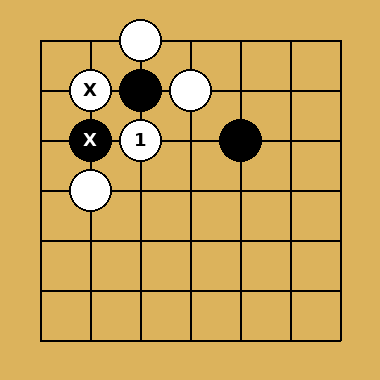
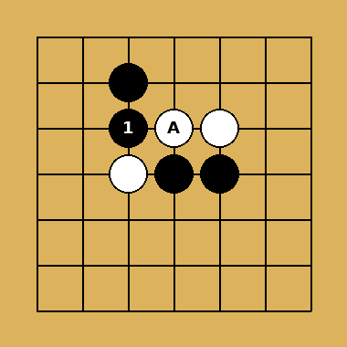
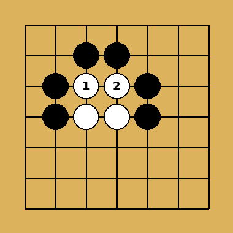
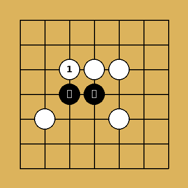
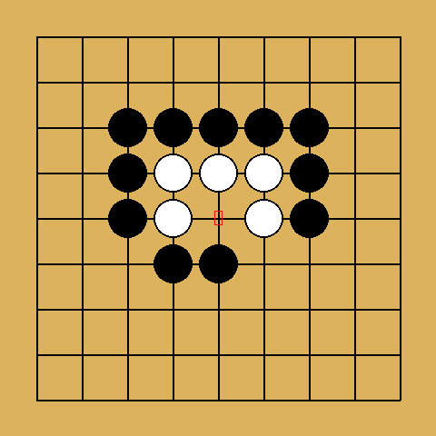
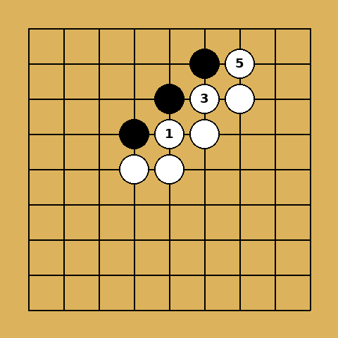

## 手筋是什麼

手筋（てすじ）是指局部戰鬥中，能以最少的棋子發揮最大效果的巧妙下法。與「俗手」相對，手筋通常違反直覺（不是簡單長氣或簡單提子），但能改變局部死活或效率。

> 學手筋的目的不是死背棋型，而是培養「這裡應該有更好下法」的直覺。

## 連接與分斷類手筋

### 接不歸
- 對方棋子被叫吃後即使應手，最終仍會被吃掉整塊
- 常見於「一靠二斷」之後：斷的那塊子讓對方無法兩全
- 判斷關鍵：算清楚對方應接後，是否還有第二次叫吃的餘地

### 相思斷
- 表面上是「斷」，實際目的是「連接」自己的棋子
- 對方無論怎麼應接，都無法救回被斷開的重要棋子
- 常搭配「一靠二斷」使用

### 雙叫吃（雙打）
- 一手棋同時叫吃兩處，對方只能救一邊
- 尋找雙打點時，先看棋盤上哪些棋子氣少、位置關鍵

## 收氣與死活類手筋

### 倒撲
- 故意送吃一子，誘使對方提子後形成自殺形（提子後反而被叫吃）
- 常見於角部收官與死活題中
- 判斷方法：對方提子後檢查是否還有氣

### 撲
- 主動送一子進入對方棋型內部，破壞對方眼形或製造倒撲條件
- 常用於做眼與破眼的攻防

### 大頭鬼
- 頭部較大的棋型被扳頭後，會因氣不夠而崩潰
- 口訣：「二子頭必扳」，看到對方二子並排時優先考慮扳頭

### 烏龜不出頭
- 對方棋型形似烏龜（頭小尾大），無法順利出頭時，持續施加壓力封住出路
- 關鍵在於封鎖優先於直接攻殺，讓對方棋子始終被悶住

## 滾打與騰挪類手筋

### 滾打包收
- 連續的扳長交換，逼迫對方形成愚形（如脹牯牛），自己則收穫外勢或先手
- 使用時機：自己需要外勢、對方棋子已經比較弱的局面
- 注意：滾打包收往往是後手，需衡量價值是否足夠

### 脹牯牛
- 被對方連續扳長逼迫而形成的又直又粗的愚形，效率極低
- 盡量避免自己被逼成脹牯牛；若對手主動送，可考慮是否值得吃

### 挖斷
- 在對方兩子之間「挖入」一子，製造斷點
- 常用於破壞對方連接的可能性，搭配後續的雙叫吃或接不歸

## 做眼與破眼類手筋

### 點方
- 對方棋型呈「方四」時，點入正中央可破壞成眼
- 對應口訣：方四是死型的關鍵形狀之一

### 尖頂
- 尖頂對方棋子，限制其擴張眼位的空間
- 常用於一步之差的死活攻防，逼對方走成「有眼殺無眼」的劣勢

### 夾
- 從對方棋子兩側夾住，限制其逃跑或連接方向
- 一間低夾、雙飛燕等常見夾擊手段皆屬此類

## 學習手筋的方法

1. **做死活題**：手筋大多來自死活與收氣的計算訓練
2. **拆解對局**：職業對局中出現手筋時，暫停思考「為什麼這手可以」
3. **分類記憶**：依「連接/分斷」「收氣」「做眼/破眼」分類整理，而非死記棋型
4. **驗算**：每個手筋使用前務必計算清楚氣數與對方的最佳應手

## 手筋相關格言

- 敵之急所，我之急所
- 有虎口點入，沒虎口縮小眼位或緊氣
- 棋子可死，但要發揮其價值
- 局部最強的手，不一定是全局最好的手，還要看價值大小
