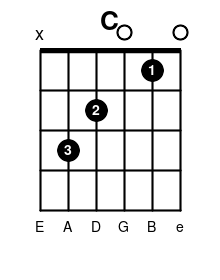
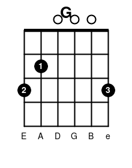
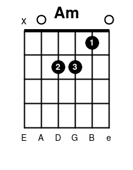
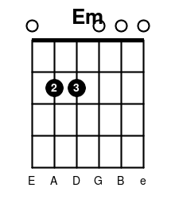
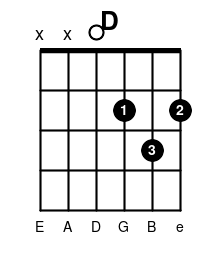
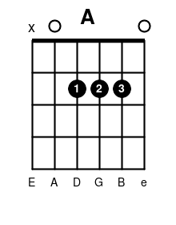
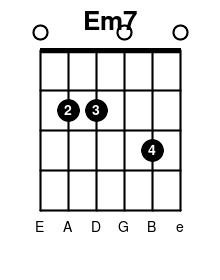
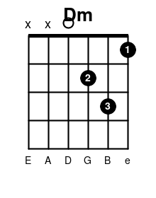

自彈自唱是很多人學吉他的最終目標：不追求古典技巧或炫技，而是能拿起吉他，彈唱出一首完整的歌。這篇整理從新手到大師的完整路線，包含每個階段該練什麼、該注意什麼、以及推薦練習曲目。

推薦曲目的完整和弦進行與譜源連結，請見另一篇：[自彈自唱推薦曲目與吉他譜](../repertoire-song-charts/)。

## 階段一：新手期（0-3 個月）目標：能彈簡單歌曲

**該練：**

- 姿勢與換把：右手撥弦（pick / 指彈）、左手按壓不悶音
- 基礎和弦：C、G、Am、Em、D、A、Em7、Dm（先練這 8 個，涵蓋 80% 流行歌）
- 換和弦流暢度：用節拍器，先求穩不求快
- 基本節奏型：Down-Down-Up-Up-Down-Up（最常用的萬用節奏）

**推薦曲目（3-4 個和弦就能彈）：**

- 五月天《突然好想你》
- 盧廣仲《100種生活》
- Ed Sheeran《Perfect》(簡化版)
- 周杰倫《晴天》(前奏+主歌)

**注意事項：**

- 每天練習比一次練很久更重要（15-20 分鐘/天 > 週末 3 小時）
- 指尖會痛是正常的，長繭後就不痛了，不要因此放棄
- 不要一開始就想學太多和弦，先把基本 8 個吃透

## 階段二：進階期（3-12 個月）目標：能自彈自唱、跟原曲節奏

**該練：**

- 大橫按（Barre Chords）：F、B、Bm — 這是大部分人卡關的地方，慢慢練，一天 10 分鐘持續 1 個月會有感
- 切分節奏、悶音（Muting）技巧
- Fingerstyle 基礎指法（Travis picking）
- 移調夾（Capo）使用，配合自己音域唱歌
- 邊彈邊唱：先分開練熟彈奏，再加唱，最後合併（不要一開始就同時練）

**推薦曲目：**

- 周杰倫《告白氣球》
- 陳綺貞《旅行的意義》
- 田馥甄《小幸運》
- Jason Mraz《I'm Yours》
- 五月天《小情歌》

**注意事項：**

- 大橫按練不好是手指力量/角度問題，不是天分問題，堅持練
- 開始學看和弦譜/簡譜（數字譜），不用學五線譜
- 錄音給自己聽，會發現很多節奏問題耳朵聽不出來

## 階段三：熟練期（1-2 年）目標：能快速學會任何一首新歌、自然轉調

**該練：**

- 常見進行套路：I-V-vi-IV（罐頭四和弦，超多流行歌都是這個）、ii-V-I
- Slash 和弦（分割和弦，如 G/B）讓過渡更順
- 節奏多樣化：Bossa Nova、Shuffle、Reggae 節奏型
- 簡單即興：Pentatonic 五聲音階 solo
- 移調能力：聽一首歌能直接抓 Key、抓和弦

**推薦曲目：**

- 五月天《倔強》《擁抱》
- 蘇打綠《小情歌》
- 深情款款類：李榮浩《模特》
- 抓歌練習：任何當紅排行榜歌曲（練耳朵）

**注意事項：**

- 開始「聽歌抓和弦」而非只找譜，這是效率關鍵能力
- 建立自己的「常用歌單」，熟練 20-30 首歌比會彈 100 首但不熟更有用
- 開始注重動態（強弱）和情感表達，不只是彈對音

## 階段四：大師期（2 年以上）目標：風格化、能編曲、能表演級演出

**該練：**

- 編曲能力：同一首歌用不同風格重新詮釋
- 即興伴奏：拿到任何一首歌的和弦就能立刻彈唱
- 進階節奏：切分、Ghost note、Percussive 技巧（拍打琴身）
- 樂理深化：模進、副屬和弦、二五一進行
- 舞台表現力：現場感、與觀眾互動、控場

**注意事項：**

- 這階段瓶頸通常是「音樂性」而非技術，多聽現場演出、Live 版本
- 找機會實戰（open mic、街頭表演）比在家練更快進步
- 開始有自己的音樂品味與詮釋方式，不再只是模仿

## 基礎 8 個和弦指法圖

新手期要先練熟的 8 個和弦，指法圖如下（黑點=按弦位置，圈=空弦彈奏，數字=建議按弦手指）：

| C | G | Am | Em |
|---|---|----|----|
|  |  |  |  |

| D | A | Em7 | Dm |
|---|---|-----|----|
|  |  |  |  |

建議練習順序：先練 C、G、Am、Em（換弦距離較小），熟練後再加 D、A、Em7、Dm。

## 效率化自彈自唱流行歌的關鍵心法

1. **先求會、再求熟、最後求美** — 別在還不熟的階段就要求完美
2. **80/20 法則**：8 個基本和弦 + 1 個萬用節奏型就能彈唱大部分流行歌
3. **拆解練習**：彈唱分開練，和弦轉換單獨練，最後才合併
4. **抓歌訓練耳朵**：比死背譜更能加速你學新歌的速度
5. **固定歌單策略**：與其會很多首但生疏，不如維持 20 首「隨時能上場」的曲目
6. **每天 15 分鐘 > 週末馬拉松**：肌肉記憶靠頻率不靠時長
7. **錄音自我檢視**：最快找出節奏/音準問題的方法
